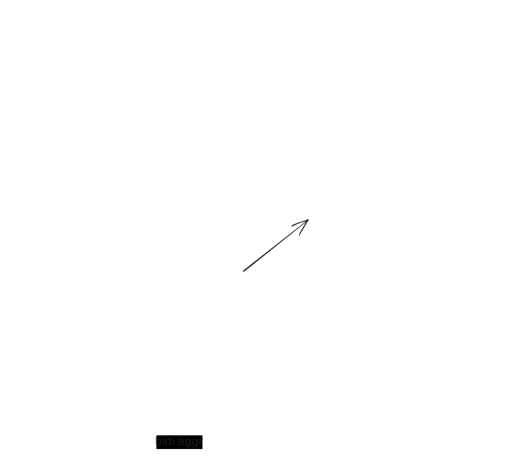

## multiverse (this is a work in progress, btw i forgot the work on this)

for my homelab

## test

```shell
go run cmd/main.go --help
```

## example

```text
λ multipass start
Launched: primary
Mounted '/Users/username' into 'primary:Home'
```

```text
λ multiverse -master
master.go: master addr: localhost:1337
master.go: api server addr: localhost:1338
```

```text
λ multiverse -worker
worker.go: master to connect addr: localhost:1337
client.go: joined with uuid: $uuid
```

```text
λ multiverse -client -shell -shell-instance-name=primary
ubuntu@primary:~$
```

```text
λ multiverse -client -nodes
Node Name     IPv4                Cpu       Mem       Disk      Last Sync
hostname      127.0.0.1:*****     1         1Gb       4Gb       2024-01-01 00:00:00 UTC
```

```text
λ multiverse -client -instances
Node Name     Instance Name     State       IPv4              Image
hostname      primary           Running     xxx.xxx.xxx.xxx   ??.?? ???
```

```text
λ multiverse -client -info
Node Name     Instance Name     Cpu       Load               Disk                      Memory
hostname      primary           1         0.07 0.02 0.00     2.5GiB out of 4.0GiB      1.3GiB out of 4.0GiB
```

## design

<picture>
  <source media="(prefers-color-scheme: dark)" srcset=".assets/architecture-dark.svg">
  <source media="(prefers-color-scheme: light)" srcset=".assets/architecture-normal.svg">
  
</picture>